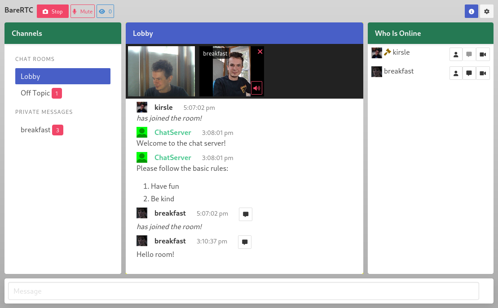

# BareRTC

BareRTC is a simple WebRTC-based chat room application. It is especially designed to be plugged into any existing website, with or without a pre-existing base of users.



It is very much in the style of the old-school Flash based webcam chat rooms of the early 2000's: a multi-user chat room with DMs and _some_ users may broadcast video and others may watch multiple video feeds in an asynchronous manner. I thought that this should be such an obvious free and open source app that should exist, but it did not and so I had to write it myself.

# Features

* Specify multiple Public Channels that all users have access to.
* Users can open direct message (one-on-one) conversations with each other.
* No long-term server side state: messages are pushed out as they come in.
* Users may broadcast their webcam which shows a camera icon by their name in the Who List. Users may click on those icons to open multiple camera feeds of other users they are interested in.
* Mobile friendly: works best on iPads and above but adapts to smaller screens well.
* WebRTC means peer-to-peer video streaming so cheap on hosting costs!
* Simple integration with your existing userbase via signed JWT tokens.
* User configurable sound effects to be notified of DMs or users entering/exiting the room.

Some important features still lacking:

* Operator controls (kick/ban users)

# Configuration

On first run it will create the default settings.toml file for you which you may then customize to your liking:

```toml
Title = "BareRTC"
Branding = "BareRTC"
WebsiteURL = "https://www.example.com"

[JWT]
  Enabled = false
  Strict = true
  SecretKey = ""

[[PublicChannels]]
  ID = "lobby"
  Name = "Lobby"
  Icon = "fa fa-gavel"
  WelcomeMessages = ["Welcome to the chat server!", "Please follow the basic rules:\n\n1. Have fun\n2. Be kind"]

[[PublicChannels]]
  ID = "offtopic"
  Name = "Off Topic"
  WelcomeMessages = ["Welcome to the Off Topic channel!"]
```

A description of the config directives includes:

* Website settings:
    * **Title** goes in the title bar of the chat page.
    * **Branding** is the title shown in the corner of the page. HTML is permitted here! You may write an `` tag to embed an image or use custom markup to color and prettify your logo.
    * **WebsiteURL** is the base URL of your actual website which is used in a couple of places:
        * The About page will link to your website.
        * If using [JWT authentication](#authentication), avatar and profile URLs may be relative (beginning with a "/") and will append to your website URL to safe space on the JWT token size!
* **JWT**: settings for JWT [Authentication](#authentication).
    * Enabled (bool): activate the JWT token authentication feature.
    * Strict (bool): if true, **only** valid signed JWT tokens may log in. If false, users with no/invalid token can enter their own username without authentication.
    * SecretKey (string): the JWT signing secret shared with your back-end app.
* **PublicChannels**: list the public channels and their configuration. The default channel will be the first one listed.
    * ID (string): an arbitrary 'username' for the chat channel, like "lobby".
    * Name (string): the user friendly name for the channel, like "Off Topic"
    * Icon (string, optional): CSS class names for FontAwesome icon for the channel, like "fa fa-message"
    * WelcomeMessages ([]string, optional): messages that are delivered by ChatServer to the user when they connect to the server. Useful to give an introduction to each channel, list its rules, etc.

# Authentication

BareRTC supports custom (user-defined) authentication with your app in the form of JSON Web Tokens (JWTs). JWTs will allow your existing app to handle authentication for users by signing a token that vouches for them, and the BareRTC app will trust your signed token.

The workflow is as follows:

1. Your existing app already has the user logged-in and you trust who they are. To get them into the chat room, your server signs a JWT token using a secret key that both it and BareRTC knows.
2. Your server redirects the user to your BareRTC website sending the JWT token as a `jwt` parameter, either in the query string (GET) or POST request.
    * e.g. you send them to `https://chat.example.com/?jwt=TOKEN`
    * If the JWT token is too long to fit in a query string, you may create a `<form>` with `method="POST"` that posts the `jwt` as a form field.
3. The BareRTC server will parse and validate the token using the shared Secret Key that only it and your back-end website knows.

There are JWT libraries available for most programming languages.

Configure a shared secret key (random text string) in both the BareRTC settings and in your app, and your app will sign a JWT including claims that look like the following (using signing method HS264):

```javascript
// JSON Web Token "claims" expected by BareRTC
{
    // Custom claims
    "sub": "username", // Username for chat (standard JWT claim)
    "op": true,  // User will have admin/operator permissions.
    "img": "/static/photos/username.jpg", // user picture URL
    "url": "/u/username",                 // user profile URL

    // Standard JWT claims that we support:
    "iss": "my own app", // Issuer name
    "exp": 1675645084,   // Expires at (time): 5 minutes out is plenty!
    "nbf": 1675644784,   // Not Before (time)
    "iat": 1675644784,   // Issued At (time)
}
```

**Notice:** your picture and profile URL may be relative URIs beginning with a forward slash as seen above; BareRTC will append them to the end of your WebsiteURL and you can save space on your JWT token size this way. Full URLs beginning with `https?://` will also be accepted and used as-is.

An example how to sign your JWT tokens in Go (using [golang-jwt](https://github.com/golang-jwt/jwt)):

```golang
import "github.com/golang-jwt/jwt/v4"

// JWT signing key - keep it a secret on your back-end shared between
// your app and BareRTC, do not use it in front-end javascript code or
// where a user can find it.
const SECRET = "change me"

// Your custom JWT claims.
type CustomClaims struct {
    // Custom claims used by BareRTC.
    Avatar     string `json:"img"`  // URI to user profile picture
    ProfileURL string `json:"url"`  // URI to user's profile page
    IsAdmin    bool   `json:"op"`   // give operator permission

    // Standard JWT claims
    jwt.RegisteredClaims
}

// Assuming your internal User struct looks anything at all like:
type User struct {
    Username       string
    IsAdmin        bool
    ProfilePicture string  // like "/static/photos/username.jpg"
}

// Create a JWT token for this user.
func SignForUser(user User) string {
    claims := CustomClaims{
        // Custom claims
        ProfileURL: "/users/" + user.Username,
        Avatar:     user.ProfilePicture,
        IsAdmin:    user.IsAdmin,

        // Standard claims
        Subject:   user.Username, // their chat username!
        ExpiresAt: time.Now().Add(5 * time.Minute),
        IssuedAt:  time.Now(),
        NotBefore: time.Now(),
        Issuer:    "my own app",
        ID:        user.ID,
    }
    token := jwt.NewWithClaims(jwt.SigningMethodHS256, claims)
    tokenStr, err := token.SignedString(SECRET)
    if err != nil {
        panic(err)
    }
    return tokenstr
}
```

## JWT Strict Mode

You can enable JWT authentication in a mixed mode: users presenting a valid token will get a profile picture and operator status (if applicable) and users who don't have a JWT token are asked to pick their own username and don't get any special flair.

In strict mode (default/recommended), only a valid JWT token can sign a user into the chat room. Set `[JWT]/Strict=false` in your settings.toml to disable strict JWT verification and allow "guest users" to log in. Note that this can have the same caveats as [running without authentication](#running-without-authentication) and is not a recommended use case.

## Running Without Authentication

The default app doesn't need any authentication at all: users are asked to pick their own username when joining the chat. The server may re-assign them a new name if they enter one that's already taken.

It is not recommended to run in this mode as admin controls to moderate the server are disabled.

### Known Bugs Running Without Authentication

This app is not designed to run without JWT authentication for users enabled. In the app's default state, users can pick their own username when they connect and the server will adjust their name to resolve duplicates. Direct message threads are based on the username so if a user logs off, somebody else could log in with the same username and "resume" direct message threads that others were involved in.

Note that they would not get past history of those DMs as this server only pushes _new_ messages to users after they connect.

# License

GPLv3.
